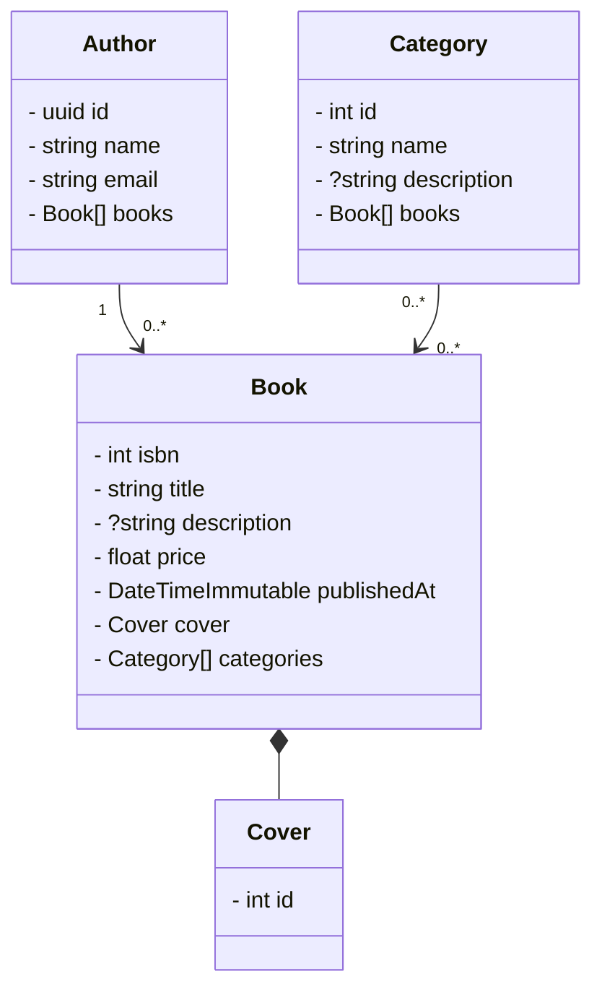

```mermaid

%% @doc https://mermaid.js.org/syntax/classDiagram.html#defining-relationship %%

%% <|--	Inheritance   %%
%% *--	Composition   (delete when parent deleted) %%
%% o--	Aggregation   (exists independamently) %%
%% -->	Association   %%
%% --	Link (Solid)  %%
%% ..>	Dependency    %%
%% ..|>	Realization   %%
%% ..	Link (Dashed) %%

classDiagram

    %% Classes %%

    class Author {
        - uuid id
        - string name
        - string email
        - Book[] books
    }

    class Category {
        - int id
        - string name
        - ?string description
        - Book[] books
    }

    class Book {
        - int isbn
        - string title
        - ?string description
        - float price
        - DateTimeImmutable publishedAt
        - Cover cover
        - Category[] categories
    }

    class Cover {
        - int id
    }

    Author   "1"    --> "0..*" Book
    Category "0..*" --> "0..*" Book
    Book            *--        Cover
```